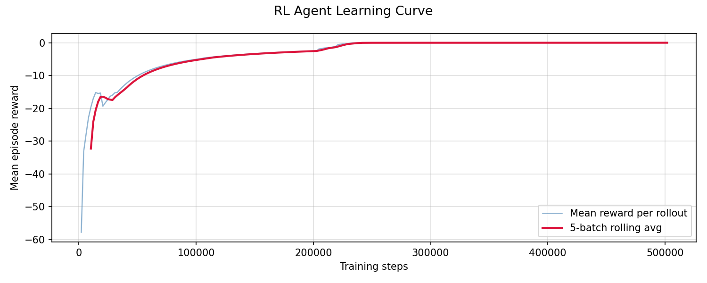

# Pendulum Stabilization (RL vs LQR)

This repository models a LIGO-like double-pendulum suspension and compares:

- `pend_rl.py` — PPO reinforcement learning controller
- `pend_controls.py` — model-based LQR-style controller

Goal: reduce bottom-mass displacement `x2` under seismic disturbance while actuating only the top mass.

---

## Core outputs and how to interpret them

### 1) RL vs passive (time domain)


- Top: `x2` in mm (gray = passive, blue = RL).
- Bottom: RL force command.
- Better control means blue remains below gray for most of the horizon with bounded force.

### 2) RL ASD


- Left: displacement ASD (passive vs RL).
- Right: RL force ASD.
- Better isolation means RL ASD is below passive in important low-frequency disturbance bands.

### 3) RL learning curve


- Reward trending toward 0 indicates policy optimization progress.
- Physical success must still be confirmed by RMS/ASD improvements.

### 4) RL no-noise regulation test


- Starts from a nonzero initial tilt with no disturbance input.
- Healthy regulation shows damped decay of `x2` and decaying force magnitude.

### 5) RL vs LQR comparison


- Left panel: controlled RMS `x2` (lower is better).
- Right panel: passive/controlled improvement factor (higher is better).
- This gives a direct “which controller is currently better” view.

### 6) LQR baseline


- Near-equilibrium model-based baseline for comparison against RL.

---

## Weights & Biases (wandb) integration

`pend_rl.py` supports optional Weights & Biases logging.

```bash
USE_WANDB=1 WANDB_PROJECT=pendulum-sim python pend_rl.py
```

What this does in practice:
- creates (or updates) a W&B run for that training session,
- logs rollout-level mean episode reward during learning,
- logs final physical metrics at eval time (`RMS passive`, `RMS RL`, improvement factor, regulation summary if enabled),
- lets you compare multiple runs/hyperparameters from the W&B dashboard.

If `wandb` is not installed, the script prints a warning and continues normally.

---

## Minimal run sequence

```bash
python pend_rl.py
python pend_controls.py
python tools_compare_performance.py
python tools_sync_docs_images.py
python tools_refresh_readme.py
```

Auto-generated summaries are injected between:
- `<!-- AUTO_RESULTS_START -->
## Latest Auto-Generated Run Summary

### RL (latest run)
- Seed: `9562`
- Passive RMS x2: `1.569 mm`
- RL RMS x2: `0.048 mm`
- Improvement factor (passive/RL): `32.45x`
- Reward initial/final: `-57.8176 -> -0.0059`
- No-noise regulation final |x2|: `0.073 mm`
- Interpretation: If improvement is < 1.0x, the policy is still underperforming passive isolation and reward scaling/actuation strategy should be revisited.

### Simple controls / LQR (latest run)
- Seed: `9615`
- Passive RMS x2: `9.309 mm`
- LQR RMS x2: `1.864 mm`
- Improvement factor (passive/LQR): `4.99x`
- Interpretation: This is your near-equilibrium model-based baseline; RL should eventually match or exceed this over repeated seeds.

### Physics notes for LIGO context
- Lower RMS and lower ASD in the microseismic band imply better suspension isolation and reduced motion coupling into interferometer sensing.
- A strong learning curve without RMS/ASD gain usually means the cost function is being optimized in a way that is not physically aligned with disturbance rejection.
<!-- AUTO_RESULTS_END -->`


## One copy-paste block (run + refresh + commit)

```bash
# Optional one-time cleanup of old root-level png files
python tools_migrate_root_pngs.py

# Generate all results + refresh README/docs artifacts
./tools_run_pipeline.sh

# Commit/push updated artifacts and summaries
git add artifacts/plots/*.png artifacts/metrics/*.json docs/_static/*.png README.md
git commit -m "Update RL/LQR artifacts and README summary"
git push
```
