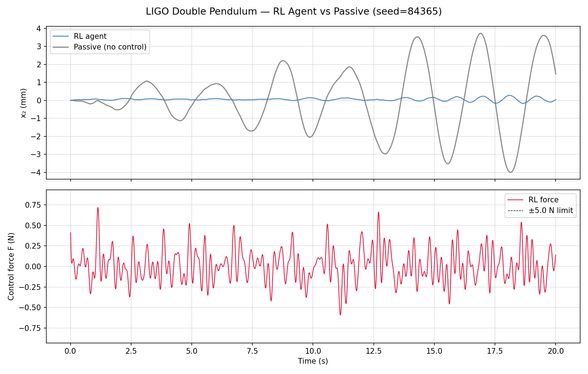
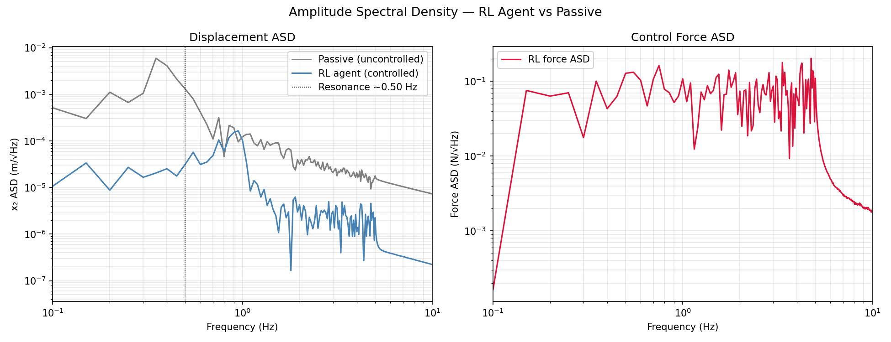
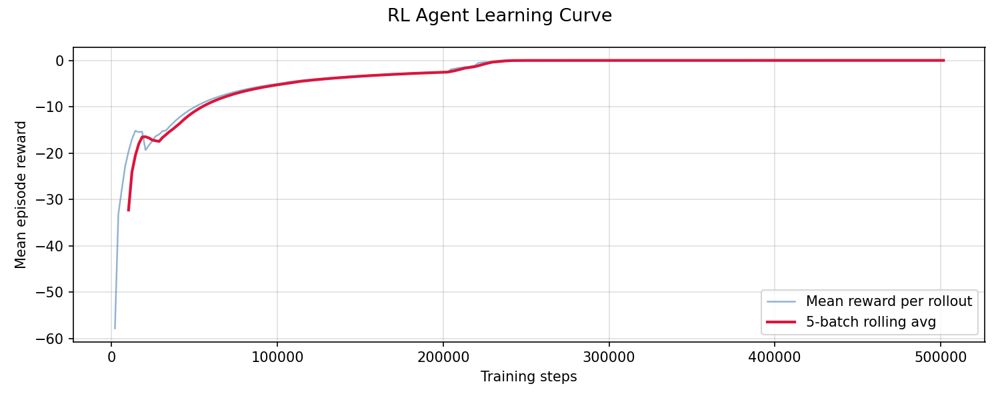
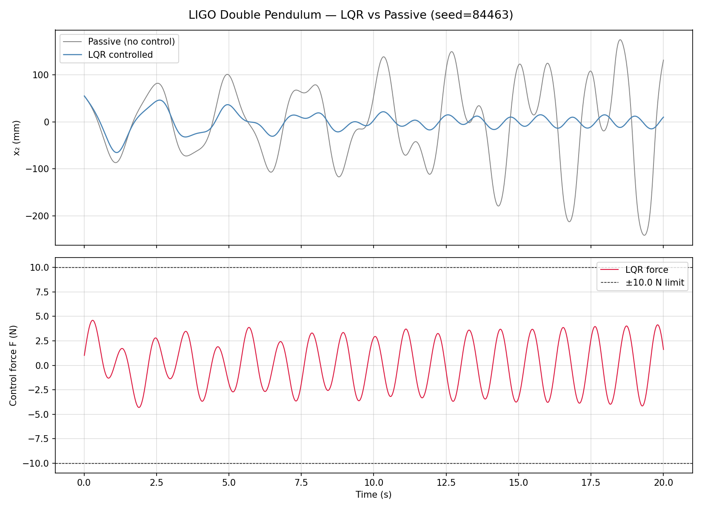

# Pendulum Stabilization: RL vs Simple Controls for a LIGO-like Suspension

This repository compares two control strategies for a double-pendulum suspension model:

- **Reinforcement Learning (PPO)** in `pend_rl.py`
<<<<<<< codex/fix-rl-agent-performance-in-pend_rl.py
- **Simple controls baseline (LQR-style linear control)** in `pend_controls.py`
=======
- **Simple controls baseline (LQR-style linear control)** in `double_pendulum_simple_controls_annotated.py`
>>>>>>> venus

The control input is force on the upper mass (`M1`). The primary science-facing objective is to reduce bottom-mass motion (`x2`) under seismic disturbance, because residual test-mass motion directly limits interferometer lock quality and low-frequency sensitivity.

---

## Quick run
<<<<<<< codex/fix-rl-agent-performance-in-pend_rl.py

```bash
# RL training + plots
python pend_rl.py

# Simple controls baseline + plot
python pend_controls.py
```

## Commands to refresh charts in README every time

Run these from the repo root:

```bash
# 1) Run RL (updates RL plots + latest_metrics_rl.json + README summary block)
python pend_rl.py

# 2) Run simple controls (updates lqr_result.png + latest_metrics_lqr.json + README summary block)
python pend_controls.py

# 3) (Optional but recommended) sync images for ReadTheDocs page rendering
python tools_sync_docs_images.py
```

You should run **both** `pend_rl.py` and `pend_controls.py` if you want both RL and simple-controls sections to show fresh numbers.

Generated files:

- RL: `rl_result.png`, `rl_asd.png`, `rl_learning_curve.png`, `rl_regulation_test.png` (if enabled)
- Simple controls: `lqr_result.png`

---

## RL plots: detailed interpretation

### 1) Time domain: RL vs Passive displacement + control force



**What this plot is physically saying**

- **Top panel** compares uncontrolled seismic response (gray) against active control (blue).
- In a LIGO context, lower blue amplitude means less mirror motion injected into the sensing chain.
- The relevant quantity is not “is it pretty?” but “is `x2` variance/RMS reduced over many seeds?”

**What “good” looks like**

- Blue remains consistently below gray over the full window.
- No long intervals where blue tracks gray one-to-one (that means no effective control authority).

**Common artifacts and what they usually mean**

- **Blue ~ gray**: policy collapsed to weak actuation, reward can still look good if effort term dominates.
- **Blue lower sometimes but spikes badly**: controller has phase mismatch near resonance.
- **Very noisy/chattery force** with little displacement gain: policy is injecting high-frequency effort without damping dominant modes.

---

### 2) ASD: displacement suppression by frequency band



**Why ASD matters for LIGO-style control**

- Time-domain plots can hide where control is helping/hurting.
- ASD tells you if disturbance rejection is happening in the frequency bands that matter.
- For suspension isolation, you generally want controlled displacement ASD below passive ASD around key low-frequency disturbance bands.

**What “good” looks like**

- Controlled `x2` ASD lies below passive over a broad low-frequency region (not just one point).
- Force ASD shows effort concentrated where disturbance is, not broad high-frequency spraying.

**Artifacts to watch**

- **Narrow high peaks in force ASD**: controller may be exciting/feeding back at specific frequencies.
- **Controlled ASD above passive near resonance**: phase-lag or gain misallocation.

---

### 3) Learning curve
=======

```bash
# RL training + plots
python pend_rl.py

# Simple controls baseline + plot
python double_pendulum_simple_controls_annotated.py
```

Generated files:

- RL: `rl_result.png`, `rl_asd.png`, `rl_learning_curve.png`, `rl_regulation_test.png` (if enabled)
- Simple controls: `lqr_result.png`

---

## RL plots: detailed interpretation

### 1) Time domain: RL vs Passive displacement + control force


**What this plot is physically saying**

- **Top panel** compares uncontrolled seismic response (gray) against active control (blue).
- In a LIGO context, lower blue amplitude means less mirror motion injected into the sensing chain.
- The relevant quantity is not “is it pretty?” but “is `x2` variance/RMS reduced over many seeds?”

**What “good” looks like**

- Blue remains consistently below gray over the full window.
- No long intervals where blue tracks gray one-to-one (that means no effective control authority).

**Common artifacts and what they usually mean**

- **Blue ~ gray**: policy collapsed to weak actuation, reward can still look good if effort term dominates.
- **Blue lower sometimes but spikes badly**: controller has phase mismatch near resonance.
- **Very noisy/chattery force** with little displacement gain: policy is injecting high-frequency effort without damping dominant modes.

---

### 2) ASD: displacement suppression by frequency band


**Why ASD matters for LIGO-style control**

- Time-domain plots can hide where control is helping/hurting.
- ASD tells you if disturbance rejection is happening in the frequency bands that matter.
- For suspension isolation, you generally want controlled displacement ASD below passive ASD around key low-frequency disturbance bands.

**What “good” looks like**

- Controlled `x2` ASD lies below passive over a broad low-frequency region (not just one point).
- Force ASD shows effort concentrated where disturbance is, not broad high-frequency spraying.

**Artifacts to watch**

- **Narrow high peaks in force ASD**: controller may be exciting/feeding back at specific frequencies.
- **Controlled ASD above passive near resonance**: phase-lag or gain misallocation.

- Left: displacement ASD of passive vs RL.
- Right: force ASD.
- **Success**: RL displacement ASD lies below passive in the disturbance band.

### 3) Learning curve



**How to read this correctly**

- Reward approaching 0 indicates optimization progress under the *defined cost*.
- This is **necessary but not sufficient** for physical success.
- Always cross-check with RMS reduction and ASD improvement.

**Failure mode**

- Reward improves while RMS gets worse → reward terms are mis-scaled relative to the physical objective.

---

### 4) No-noise regulation test


**What this isolates**

- Starts from initial tilt, with disturbance off.
- Tests whether controller can stabilize intrinsic dynamics before disturbance-rejection complexity.

**What “good” looks like**

- `x2` decays toward zero with damped oscillations.
- Force is larger initially, then decays as state energy is removed.

**If this fails**

- Disturbance rejection under noise will almost always fail too.

---

## Simple controls (baseline) interpretation
>>>>>>> venus



- Provides a sanity baseline for what a model-based controller can do near equilibrium.
- If RL cannot match/beat this baseline over repeated seeds, that points to reward/observation/hyperparameter issues rather than plant impossibility.

---

## Why you currently see blue link text instead of embedded charts

<<<<<<< codex/fix-rl-agent-performance-in-pend_rl.py
**How to read this correctly**

- Reward approaching 0 indicates optimization progress under the *defined cost*.
- This is **necessary but not sufficient** for physical success.
- Always cross-check with RMS reduction and ASD improvement.

**Failure mode**

- Reward improves while RMS gets worse → reward terms are mis-scaled relative to the physical objective.

---

### 4) No-noise regulation test


**What this isolates**

- Starts from initial tilt, with disturbance off.
- Tests whether controller can stabilize intrinsic dynamics before disturbance-rejection complexity.

**What “good” looks like**

- `x2` decays toward zero with damped oscillations.
- Force is larger initially, then decays as state energy is removed.

**If this fails**

- Disturbance rejection under noise will almost always fail too.

---

## Simple controls (baseline) interpretation


- Provides a sanity baseline for what a model-based controller can do near equilibrium.
- If RL cannot match/beat this baseline over repeated seeds, that points to reward/observation/hyperparameter issues rather than plant impossibility.

---

## Why you currently see blue link text instead of embedded charts

If GitHub shows image text links instead of rendered images, the files are missing at those paths in the branch being viewed.

### Required steps on your side

1. Run scripts locally to generate PNGs.
2. Ensure files exist in repo root (`rl_result.png`, `rl_asd.png`, `rl_learning_curve.png`, `lqr_result.png`, optionally `rl_regulation_test.png`).
3. `git add` those PNG files and push the same branch as the README.
4. For ReadTheDocs, copy those PNGs to `docs/_static/` and commit.

Helper script:

```bash
python tools_sync_docs_images.py
```

---

=======
If GitHub shows image text links instead of rendered images, the files are missing at those paths in the branch being viewed.

### Required steps on your side

1. Run scripts locally to generate PNGs.
2. Ensure files exist in repo root (`rl_result.png`, `rl_asd.png`, `rl_learning_curve.png`, `lqr_result.png`, optionally `rl_regulation_test.png`).
3. `git add` those PNG files and push the same branch as the README.
4. For ReadTheDocs, copy those PNGs to `docs/_static/` and commit.

Helper script:

```bash
python tools_sync_docs_images.py
```

---

>>>>>>> venus
## ReadTheDocs/Sphinx integration checklist

- RTD config file exists: `.readthedocs.yaml`
- Sphinx dependency pinned: `docs/requirements.txt`
- Docs page references `docs/_static/*.png`
- PNG files are committed to the branch RTD is building

Build locally (if Sphinx installed):

```bash
python -m sphinx -b html docs docs/_build/html
```

<<<<<<< codex/fix-rl-agent-performance-in-pend_rl.py
---

## Note on branch naming

I hear you on branch naming. In this execution environment I cannot control/create your remote branch names directly; I can only commit on the current local branch. On your side, you can rename or create branches however you prefer (without `codex` labels).


<!-- AUTO_RESULTS_START -->
## Latest Auto-Generated Run Summary

No run summaries found yet. Run `python pend_rl.py` and/or `python pend_controls.py` first.

### Physics notes for LIGO context
- Lower RMS and lower ASD in the microseismic band imply better suspension isolation and reduced motion coupling into interferometer sensing.
- A strong learning curve without RMS/ASD gain usually means the cost function is being optimized in a way that is not physically aligned with disturbance rejection.
<!-- AUTO_RESULTS_END -->
=======
Docs source is in `docs/`. RTD shows only files that are committed to Git.
So if images appear as missing/question marks on RTD, generate plots locally and commit the output PNG files.

## Note on branch naming

I hear you on branch naming. In this execution environment I cannot control/create your remote branch names directly; I can only commit on the current local branch. On your side, you can rename or create branches however you prefer (without `codex` labels).
>>>>>>> venus
