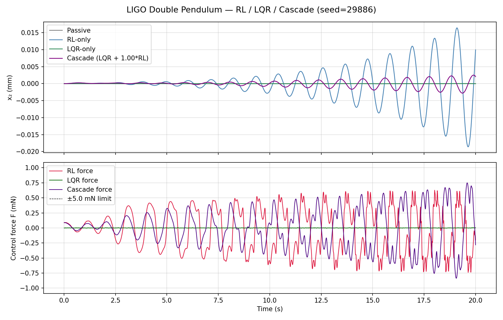
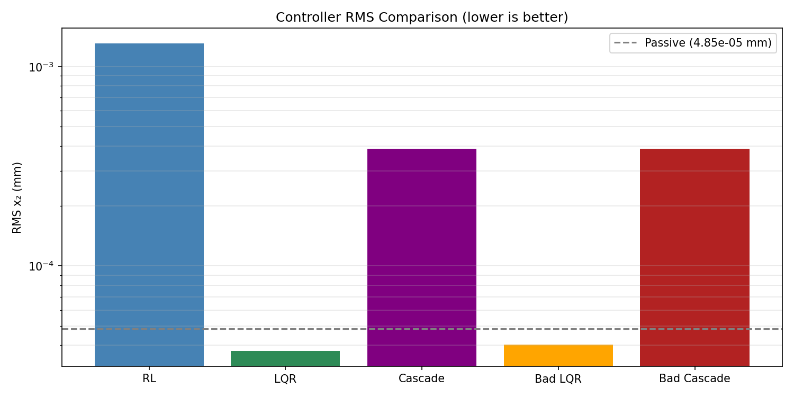
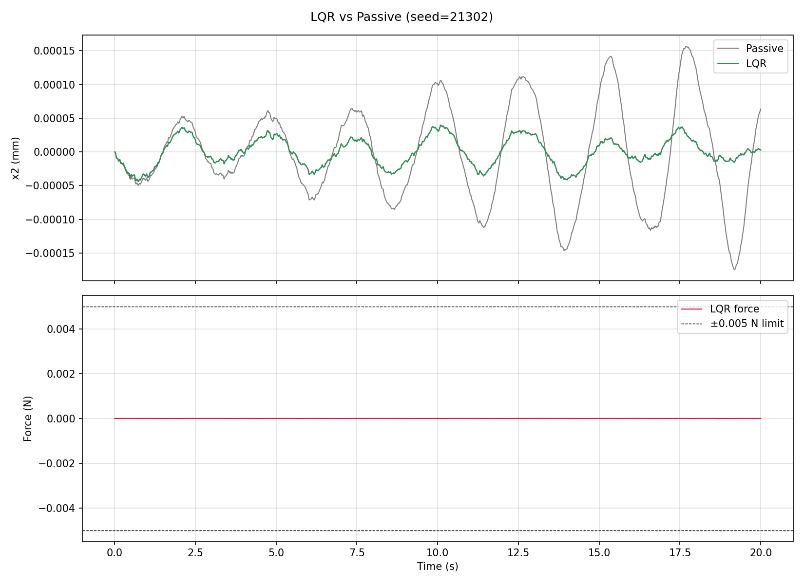

# Pendulum Stabilization (RL vs LQR).........

This repository models a LIGO-like double-pendulum suspension and compares:

- `pend_rl.py` — PPO reinforcement learning controller
- `pend_controls.py` — model-based LQR-style controller

Goal: reduce bottom-mass displacement `x2` under seismic disturbance while actuating only the top mass.

---

## Project hygiene / structure

```text
src/pendulum_sim/
  noise.py            # all seismic-noise generation utilities and configs
  rl_pipeline.py      # packaged RL train/eval implementation
  lqr_pipeline.py     # packaged LQR baseline implementation
tests/
  test_noise.py       # deterministic + shape sanity checks for noise
  test_lqr_math.py    # linearization/LQR matrix sanity checks
pend_rl.py            # thin CLI wrapper -> pendulum_sim.rl_pipeline
pend_controls.py      # thin CLI wrapper -> pendulum_sim.lqr_pipeline
tools_*.py            # docs/readme/plot helper scripts
pyproject.toml        # pip-installable package metadata
environment.yml       # conda environment
requirements.txt      # pip requirements snapshot
```

### Install (pip)

```bash
python -m pip install -e .
python -m pip install -e .[test,wandb]
```

### Run tests

```bash
pytest
```

---

## Core outputs and how to interpret them

### 1) RL / LQR / Cascade (time domain)


- Top: `x2` in mm for passive, RL-only, LQR-only, and cascade.
- Bottom: control forces.
- Better control means smaller `x2` envelope with bounded force.
- **What you should expect if things are working well**:
  - `Passive` usually has the largest oscillation envelope (worst rejection).
  - `LQR` should strongly damp near-equilibrium motion.
  - `RL` may match or beat LQR after enough training timesteps.
  - `Cascade` (LQR + RL) is often best when RL learns useful residual corrections.
- **What a bad run looks like**:
  - RL trace larger than passive (policy not learned or unstable).
  - Force trace clipped near ±`F_MAX` most of the time (controller saturating).
  - Regulation drift/growth instead of decay.
- **Why this plot matters**:
  - It is the easiest “physics sanity check” because it directly shows bottom-mirror displacement and actuator effort over time.

### 2) ASD (frequency-domain)


- ASD = amplitude spectral density (`m/√Hz` for displacement).
- Lower ASD means less vibration/noise at that frequency band.
- Focus most on low-frequency disturbance bands for suspension isolation.
- **What you should expect**:
  - Controlled curves (RL/LQR/cascade) should sit below passive through key low-frequency disturbance bands.
  - It is normal if a controller improves one band while worsening another slightly.
- **What is “good” for this project**:
  - Reduced ASD in your target disturbance region (e.g., microseismic-relevant low frequencies) without exploding force noise.
- **Why this plot matters**:
  - Time-domain RMS can hide where improvement happens; ASD tells you *which frequencies* improved or degraded.

### 3) Controller comparison bars


- Compares RMS `x2` for RL-only, LQR-only, cascade, and stress-test variants.
- Lower RMS is better.
- **What you should expect**:
  - `Passive` baseline (dashed reference line) should be above good controllers.
  - `Bad LQR` / `Bad Cascade` are intentionally weaker stress tests and should usually perform worse than normal LQR/cascade.
- **Why this plot matters**:
  - It gives a quick experiment-level ranking when you compare many runs/hyperparameters.

## Core outputs and how to interpret them

- Starts from nonzero initial tilt with no disturbance.
- Healthy regulation should decay toward zero. If oscillations grow, that policy is unstable for this test.
- **What you should expect**:
  - If policy is stable around equilibrium, envelope decays and force settles.
  - If it grows or keeps large sustained oscillations, RL learned disturbance rejection but not robust regulation from that initial condition.
- **Why this plot matters**:
  - It separates “noise rejection performance” from “intrinsic closed-loop stability.”

### 5) LQR baseline


- Near-equilibrium model-based baseline for comparison against RL.
- **What you should expect**:
  - LQR should be strong near the linearized operating point and may degrade farther from that regime.
- **Why this plot matters**:
  - It is your interpretable baseline: RL should eventually match/beat this on your target metrics.

---

## Minimal run sequence

```bash
python pend_rl.py
python pend_controls.py
python tools_compare_performance.py
python tools_sync_docs_images.py
python tools_refresh_readme.py
```

## One copy-paste block (run + refresh + commit)

```bash
# Optional one-time cleanup of old root-level png files
python tools_migrate_root_pngs.py

# Generate all results + refresh README/docs artifacts
./tools_run_pipeline.sh

# Commit/push updated artifacts and summaries
# (this is required if you want GitHub README graphs to actually change)
git add artifacts/plots/*.png artifacts/metrics/*.json docs/_static/*.png README.md
git commit -m "Update RL/LQR artifacts and README summary"
git push
```

### Why graphs may not update on GitHub README

- Running scripts locally is not enough — updated PNGs must be committed and pushed.
- If still stale after push, hard-refresh the browser (cache).

---

## What “bad cascade” means

- `bad_lqr_scale` (default `0.35`) intentionally weakens LQR in evaluation.
- **Bad cascade** = weakened LQR + RL contribution.
- It is a stress test only and does **not** overwrite your main RL/LQR setup.

---

## Weights & Biases (W&B) quickstart

If you are brand new to W&B, think of it as a **live experiment notebook + dashboard**:
- every training/eval run is logged as one “run,”
- metrics are stored automatically (no spreadsheet copying),
- you can compare runs side-by-side (different seeds/reward settings/cascade weights).

In this repo specifically:
- `pend_rl.py` logs RL training/eval metrics like `rms_rl_mm`, `rms_lqr_mm`, `rms_cascade_mm`, and improvements.
- `pend_controls.py` logs LQR baseline metrics.
- Using the same `WANDB_GROUP` lets you compare RL and LQR runs in one place.

1. Install and login:

```bash
pip install wandb
wandb login
```

2. Run RL tracked in your team/project:

```bash
USE_WANDB=1 WANDB_ENTITY=<your-team> WANDB_PROJECT=pendulum-sim WANDB_GROUP=rl_vs_lqr python pend_rl.py
```

3. Run LQR in the same W&B group:

```bash
USE_WANDB=1 WANDB_ENTITY=<your-team> WANDB_PROJECT=pendulum-sim WANDB_GROUP=rl_vs_lqr python pend_controls.py
```

Then compare runs in W&B by metrics such as `rms_rl_mm`, `rms_lqr_mm`, `rms_cascade_mm`, and improvement factors.

### Exactly what you should do each time (simple workflow)

1. Choose one experiment change (example: `CASCADE_ALPHA=0.8` or different reward refs).
2. Run RL with W&B enabled.
3. Run LQR baseline with W&B enabled.
4. Open W&B project page, filter by `WANDB_GROUP=rl_vs_lqr`.
5. Sort/compare by:
   - `rms_cascade_mm` (lower better),
   - `improvement_cascade_x` (higher better),
   - `reg_final_abs_x2_mm` (lower better for regulation).
6. Keep notes for the best setting and repeat.

---

## Auto-generated latest summary block

`tools_refresh_readme.py` rewrites only this section from latest metrics files:

<!-- AUTO_RESULTS_START -->
## Latest Auto-Generated Run Summary

### RL (latest run)
- Seed: `70671`
- Passive RMS x2: `0.174 mm`
- RL RMS x2: `0.017 mm`
- Improvement factor (passive/RL): `10.54x`
- Reward initial/final: `-6.4477 -> -0.0010`
- No-noise regulation final |x2|: `74.872 mm`
- Interpretation: If improvement is < 1.0x, the policy is still underperforming passive isolation and reward scaling/actuation strategy should be revisited.

### Simple controls / LQR (latest run)
- Seed: `62383`
- Passive RMS x2: `2.254 mm`
- LQR RMS x2: `0.126 mm`
- Improvement factor (passive/LQR): `17.88x`
- Interpretation: This is your near-equilibrium model-based baseline; RL should eventually match or exceed this over repeated seeds.

### How to read the plots
- **Time-domain x2 plot**: smaller oscillation envelope means better isolation of the bottom mirror displacement.
- **ASD plot**: each point is displacement amplitude per √Hz at that frequency; lower curve means less motion/noise coupling at that band.
- **Controller comparison bars**: direct RMS comparison for RL-only, LQR-only, cascade, and bad-LQR stress tests using the same seed.

### Physics notes for LIGO context
- Lower RMS and lower ASD in the microseismic band imply better suspension isolation and reduced motion coupling into interferometer sensing.
- A strong learning curve without RMS/ASD gain usually means the cost function is being optimized in a way that is not physically aligned with disturbance rejection.
<!-- AUTO_RESULTS_END -->
