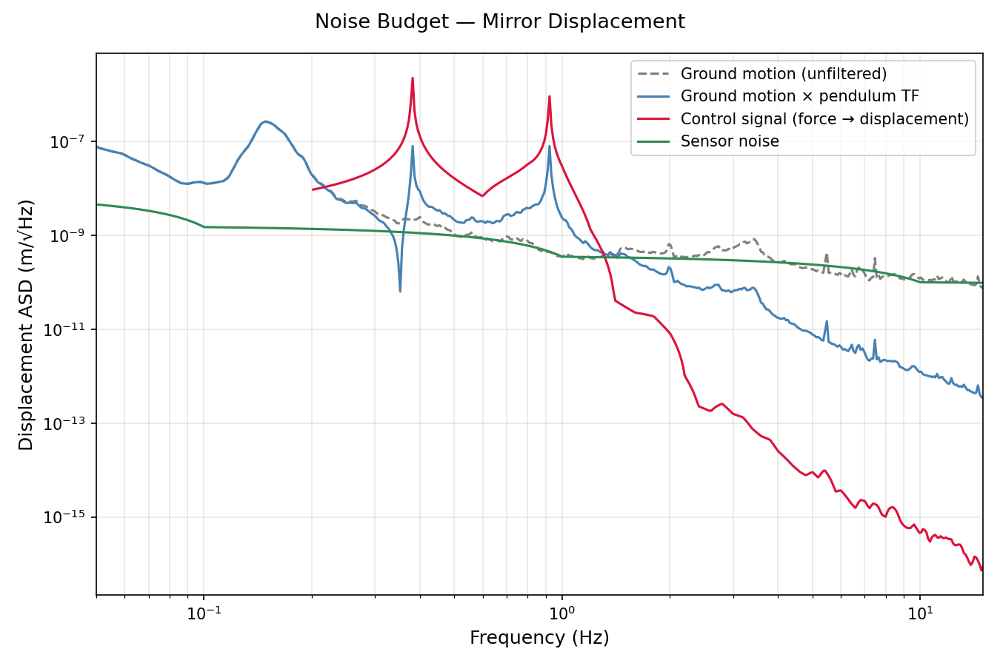
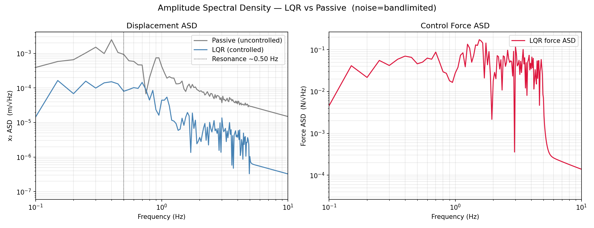
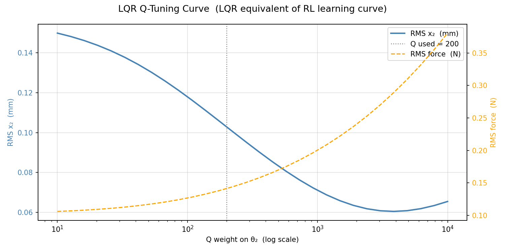

# Pendulum Stabilization Tutorial (RL vs LQR)

An interactive project for learning suspension control on a LIGO-like double pendulum, comparing a reinforcement-learning controller to a model-based LQR baseline.

## What this project covers

### Main experiment scripts

- `pend_rl.py` — train/evaluate PPO controller on disturbance rejection.
- `pend_controls.py` — run model-based LQR baseline on the same plant/noise setup.
- `tools/tools_compare_performance.py` — compare RL/LQR/cascade and produce summary plots.

### Topics

| Section | Topic |
|---|---|
| 1 | **Double-pendulum dynamics**: equations of motion and physical parameterization (`src/pendulum_sim/physics.py`). |
| 2 | **Linear control baseline**: linearization + LQR synthesis and regulation behavior (`src/pendulum_sim/control.py`, `src/pendulum_sim/lqr_pipeline.py`). |
| 3 | **Seismic disturbance modeling**: synthetic and external ASD-driven disturbance generation (`src/pendulum_sim/noise.py`, `noise/`). |
| 4 | **RL environment and training**: Gymnasium environment, reward shaping, PPO orchestration (`src/pendulum_sim/rl_env.py`, `src/pendulum_sim/rl_core.py`). |
| 5 | **Evaluation modes**: RL-only, LQR-only, and cascade comparisons on shared seeds (`src/pendulum_sim/rl_eval.py`, `tools/tools_compare_performance.py`). |
| 6 | **Frequency-domain analysis**: ASD plots for displacement/noise rejection (`artifacts/plots/rl_asd.png`, `artifacts/plots/lqr_asd.png`). |
| 7 | **Reporting assets**: automatic plot/metrics refresh for docs (`tools/tools_sync_docs_images.py`, `tools/tools_refresh_readme.py`). |

## Physics/computation highlights

- RL and LQR are evaluated on the same underlying plant and disturbance framework for direct comparison.
- Frequency-domain (ASD) and time-domain metrics are both used so performance is not judged by a single scalar.
- Cascade mode provides a practical hybrid-control comparison in addition to standalone RL/LQR modes.
- Implemented with NumPy/SciPy + Stable-Baselines3; no specialized suspension-control package required.

## Audience

Students and researchers interested in controls for precision-mechanics systems (especially interferometer-style suspension isolation), with basic familiarity in classical control and reinforcement learning.

## Local development

```bash
git clone <your-fork-or-repo-url>
cd pendulum_sim
python -m pip install -e .
python -m pip install -e '.[test,wandb]'
cp .env.example .env
```

## Run sequence

```bash
pytest
./tools/tools_run_pipeline.sh
```

Equivalent manual sequence:

```bash
python pend_rl.py
python pend_controls.py
python tools/tools_compare_performance.py
python tools/tools_sync_docs_images.py
```

## Repository map

- `src/pendulum_sim/` — package source (dynamics, control, RL, reporting).
- `tools/` — automation scripts for running pipelines and refreshing assets.
- `tests/` — physics/control/noise/reward tests.
- `artifacts/` — generated plots + metrics JSON outputs.
- `docs/` — Sphinx docs/static images.


## Generated diagrams

The pipeline writes plots to `artifacts/plots/`. Key diagrams produced by the current source include:

- RL/LQR/Cascade time-domain response  
  
- RL vs passive ASD  
  
- RL/LQR/Cascade RMS comparison  
  
- Controller comparison summary  
  
- RL learning curve  
  
- RL regulation test  
  
- RL spectrogram (x2 vs time/frequency)  
  
- RL noise budget  
  
- LQR baseline time-domain response  
  
- LQR regulation test  
  
- LQR ASD  
  
- LQR Q-tuning curve  
  
- LQR gang-of-four diagnostics  
  
- External noise validation  
  
