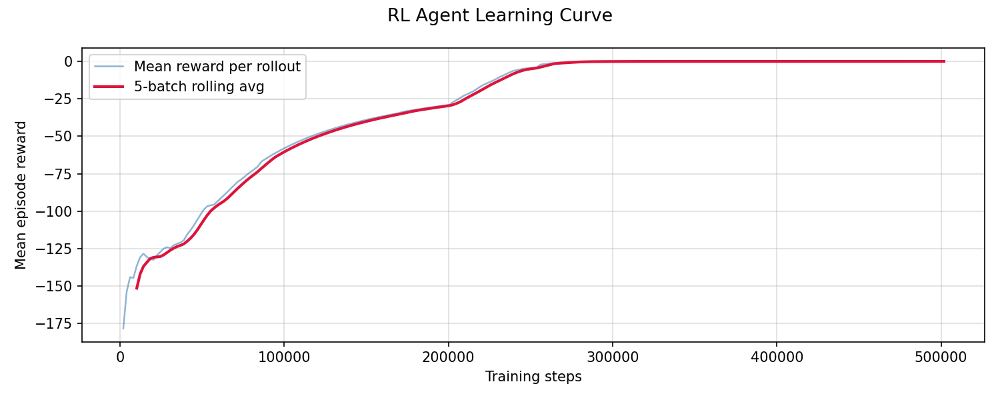
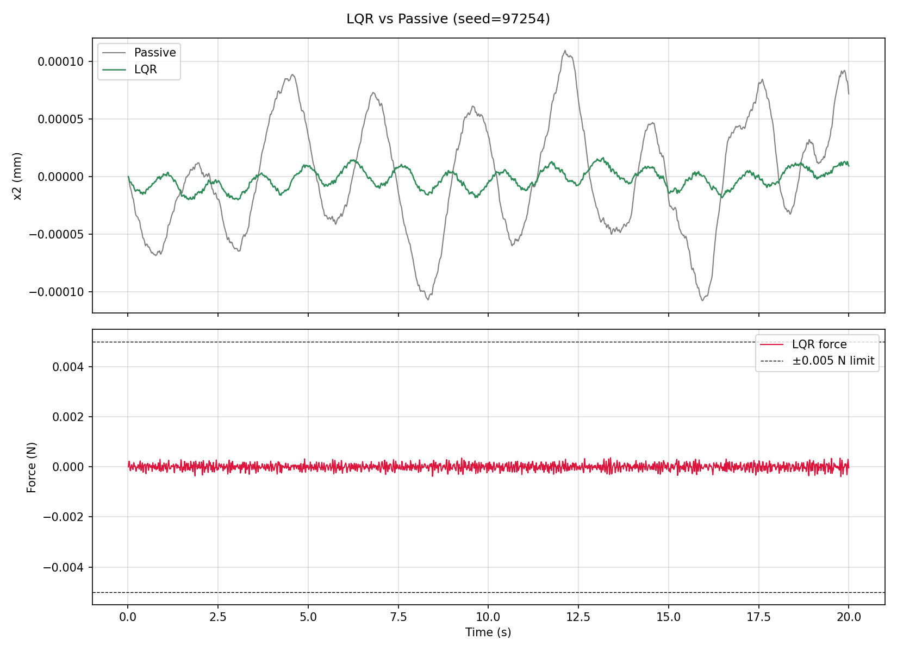
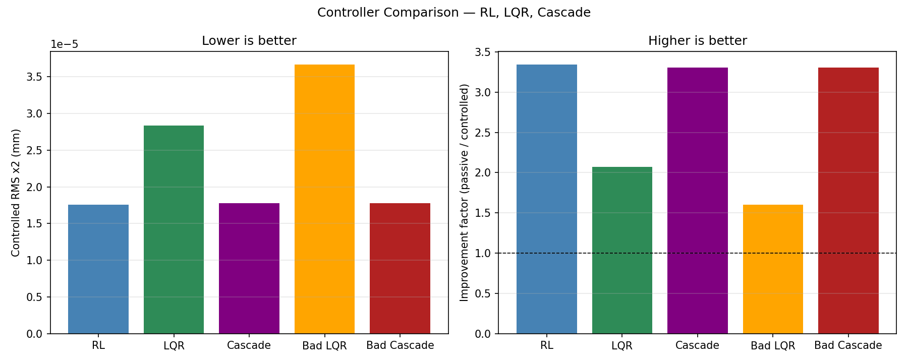

Pendulum Stabilization Docs (RL + Simple Controls)
- Displacement ASD should be below passive in key disturbance bands.
- Force ASD should show structured control effort, not broad noisy actuation.

Physics interpretation:

- ASD reveals where in frequency space control is helping or hurting.
- A controller can look good in time-domain snapshots but still inject noise at critical bands.

RL plot 3: Learning curve
-------------------------

- Reward rising toward 0 means optimization progress under the chosen cost.
- Must be validated against physical metrics (RMS and ASD), not reward alone.

RL plot 4: No-noise regulation test
------------------------------------

.. image:: _static/rl_regulation_test.png
   :alt: RL regulation test
   :width: 900px

- Initial tilt, no disturbance.
- Successful regulation shows damped decay of ``x2`` toward zero and decaying force magnitude.

Simple-controls baseline
------------------------

- Use as a baseline sanity check for near-equilibrium stabilization quality.

If plots show as links/question marks
-------------------------------------

That means image files are not present in the built branch/docs path.

Checklist:

1. Generate images locally.
2. Commit images in `artifacts/plots` used by README.
3. Copy to ``docs/_static/`` for RTD.
4. Commit and push.

Minimal sync command:

.. code-block:: bash

   python tools_compare_performance.py
   python tools_sync_docs_images.py

Controller comparison
---------------------

- Left: RMS displacement comparison (lower is better).
- Right: improvement factor comparison (higher is better).
