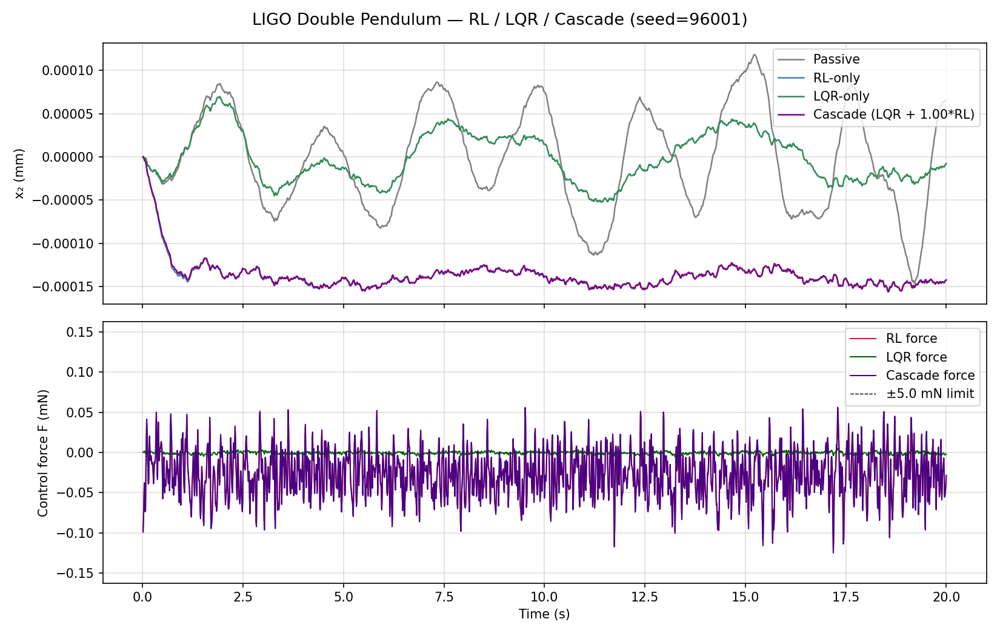
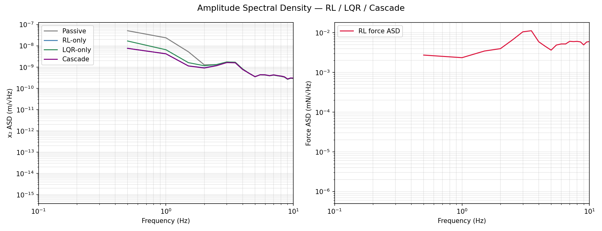

Pendulum Stabilization Documentation
===================================

This documentation explains the produced graphs for:

- PPO reinforcement learning controller (``pend_rl.py``)
- Simple controls baseline (``double_pendulum_simple_controls_annotated.py``)

Run commands
------------

.. code-block:: bash

   python pend_rl.py
   python double_pendulum_simple_controls_annotated.py

RL output graphs
----------------

1) RL vs passive (time domain)
^^^^^^^^^^^^^^^^^^^^^^^^^^^^^^

- Top panel: bottom-mass displacement ``x2`` (mm).
- Bottom panel: control force.
- Success: RL displacement stays below passive while force remains bounded.

2) ASD plot
^^^^^^^^^^^

- Success: RL displacement ASD below passive in the low-frequency disturbance band.

3) Learning curve
^^^^^^^^^^^^^^^^^

.. image:: _static/rl_learning_curve.png
   :alt: RL learning curve
   :width: 900px

- Reward should improve toward 0, but physical metrics (RMS/ASD) remain the final check.

4) Regulation test (no noise)
^^^^^^^^^^^^^^^^^^^^^^^^^^^^^^

.. image:: _static/rl_regulation_test.png
   :alt: RL regulation test
   :width: 900px

- Success: ``x2`` decays toward zero from a tilted initial state.

Simple controls output
----------------------

.. image:: _static/lqr_result.png
   :alt: Simple controls (LQR) result
   :width: 900px

- Top panel: passive vs controlled ``x2``.
- Bottom panel: control force.

How to keep images visible on RTD
---------------------------------

Read the Docs does not run long simulations during docs build.
Commit image files to ``docs/_static/`` so pages always render with plots.

Example sync commands:

.. code-block:: bash

   cp rl_result.png docs/_static/rl_result.png
   cp rl_asd.png docs/_static/rl_asd.png
   cp rl_learning_curve.png docs/_static/rl_learning_curve.png
   cp rl_regulation_test.png docs/_static/rl_regulation_test.png
   cp lqr_result.png docs/_static/lqr_result.png
