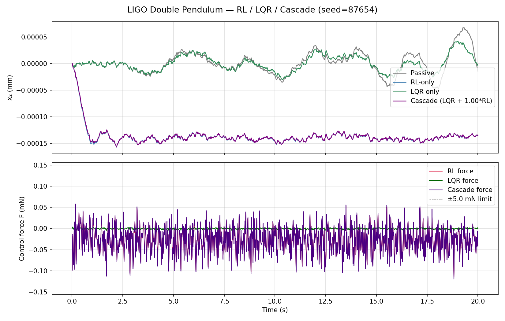
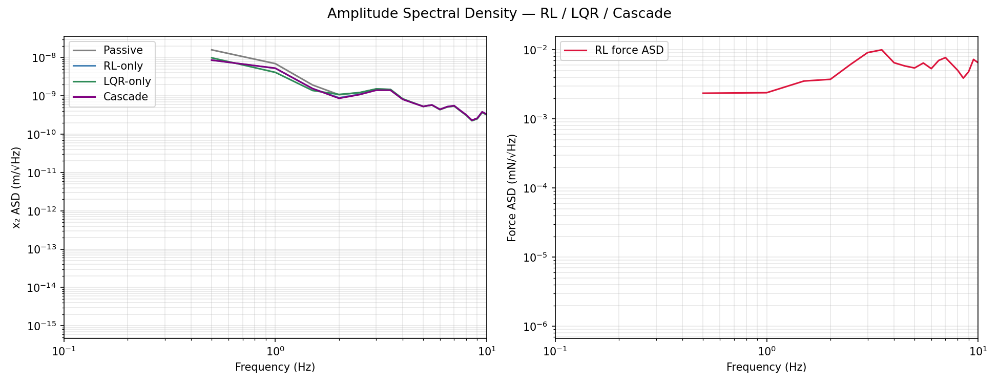
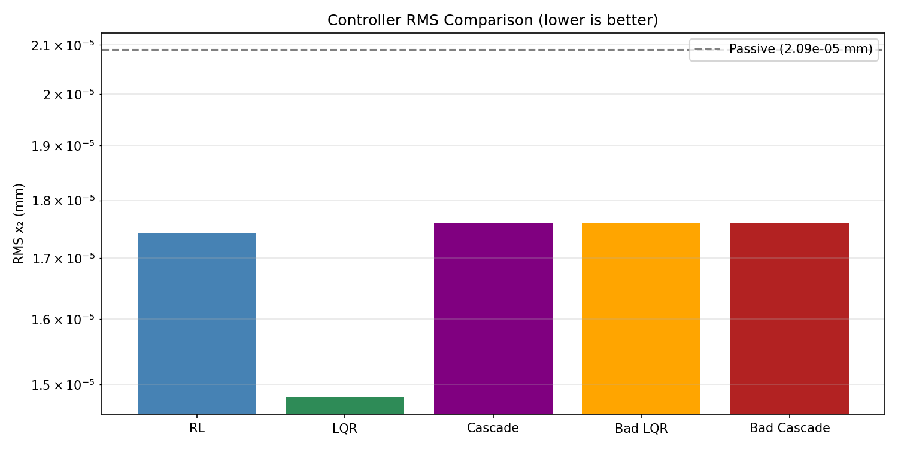
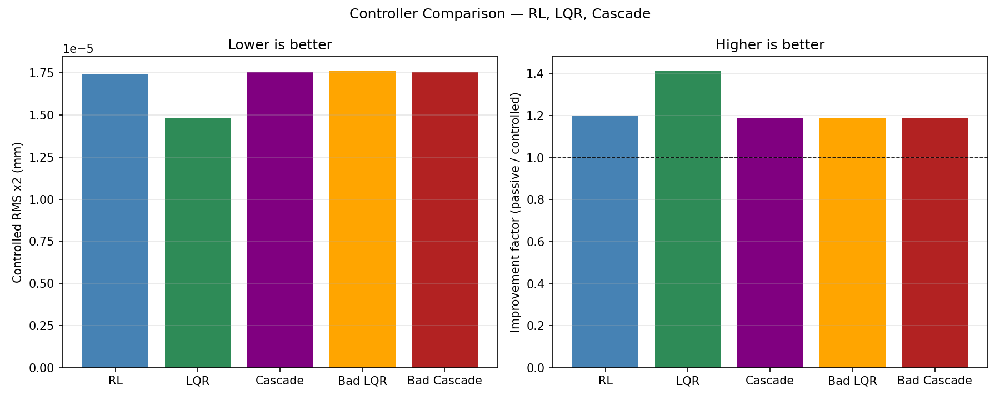
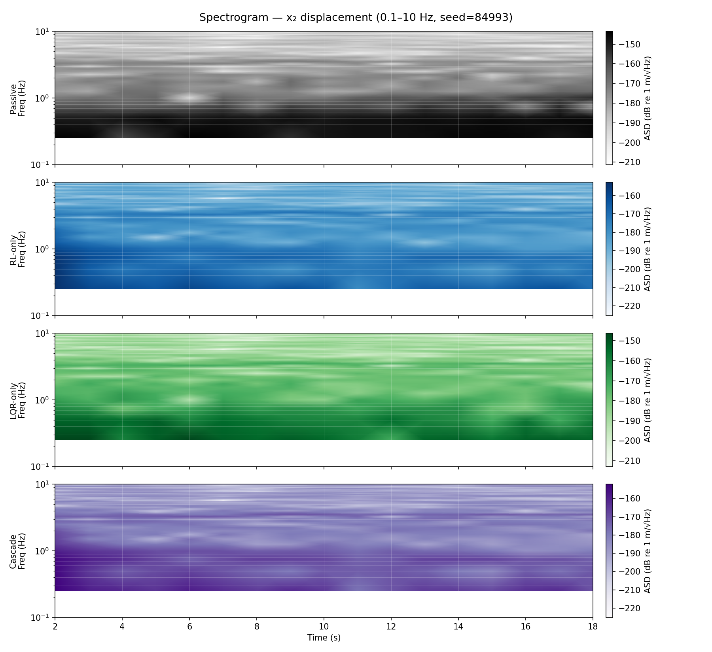
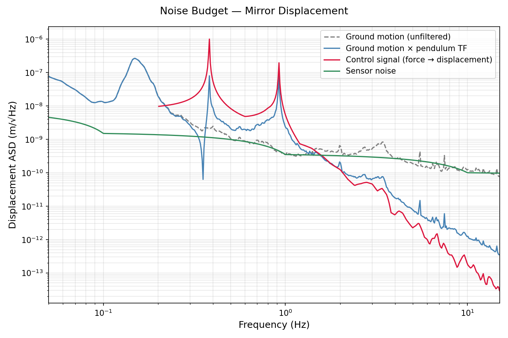
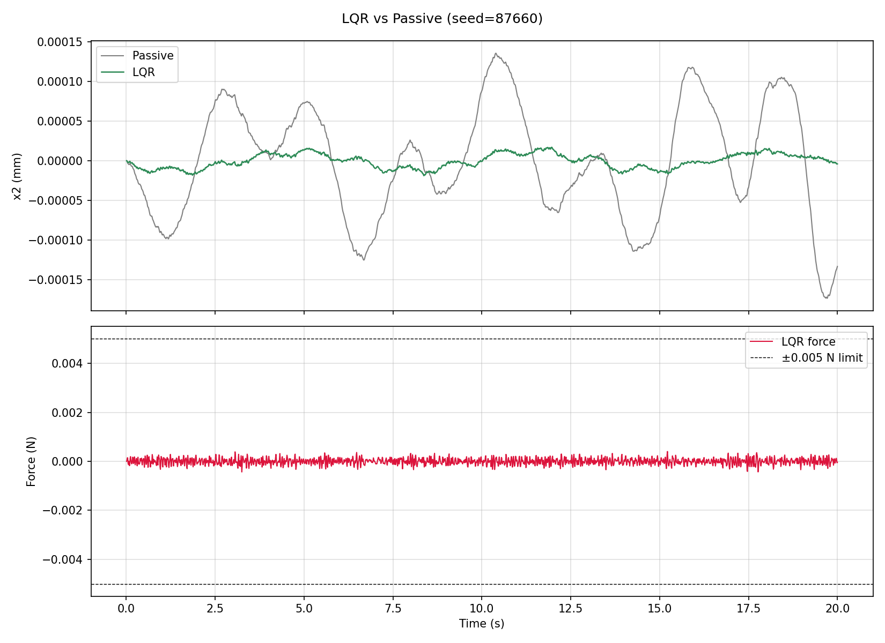
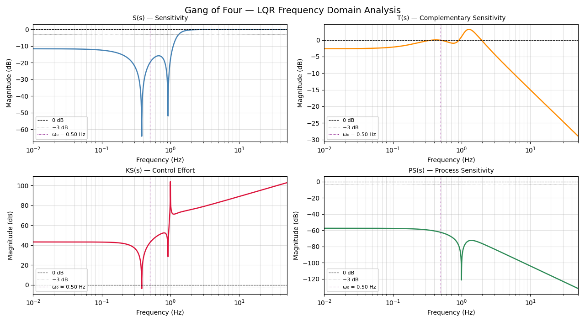

# run_006

Created: 2026-05-13 16:00:06 UTC

## Summary

- RL seed: `87654`
- RL improvement: `1.20x`
- LQR seed: `87660`
- LQR improvement: `7.96x`
- Cascade improvement: `1.19x`

## Diagrams

### rl_result.png

### rl_asd.png

### rl_lqr_cascade_comparison.png

### controller_comparison.png

### rl_learning_curve.png

### rl_regulation_test.png

### rl_spectrogram.png

### rl_noise_budget.png

### lqr_result.png

### lqr_regulation_test.png

### lqr_asd.png

### lqr_q_tuning_curve.png

### lqr_gang_of_four.png

### external_noise_validation.png

